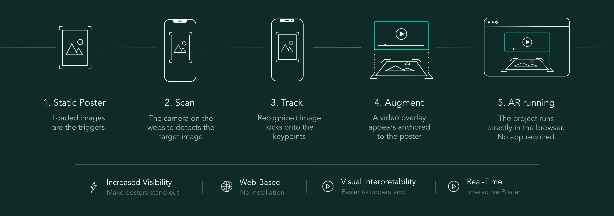

<p align="center">
  
</p>

<p align="center">
  <i>Turn static posters into interactive AR experiences with video overlays. The project works directly in the browser.</i>
</p>

<p align="center">
  💡 <a href="#what-is-arspace">What is arspace?</a> &nbsp; • &nbsp;
  🚀 <a href="#quick-start">Quick Start</a> &nbsp; • &nbsp;
  🛠️ <a href="#customization">Customization</a> &nbsp; • &nbsp;
  ☁️ <a href="#deployment">Deployment</a>
</p>

---

## 💡 What is arspace?

**arspace** is a lightweight tool designed to help researchers increase the visibility of their work at poster sessions—without relying on tablets taped to posters or external devices. Instead, you can attach interactive, animated content directly to your poster images. Viewers simply **scan the poster with their phone** and instantly see videos or animations on top of the printed material.

The entire system runs in the browser using WebAR technology, so there is nothing to install—just open a link and start exploring:

<p align="center">
  
</p>


### Examples

Visitors scan the poster with their phone and see the projected video on the printout — no app install:

<p align="center">
  
  &nbsp;&nbsp;&nbsp;
  
</p>

<p align="center">
  <em>arspace in action at a conference — visitors scan the poster to see animated content</em>
</p>

---

## 🚀 Quick Start

1. **Clone the repository**
   ```bash
   git clone https://github.com/your-username/arspace.git
   cd arspace
   ```

## Project Structure

```
arspace/
├── index.html              # Main entry point
├── css/
│   └── styles.css          # UI styles
├── js/
│   └── app.js              # AR application logic
├── assets/
│   ├── demo/               # Demo images and video
│   ├── targets/
│   │   └── targets.mind    # Compiled AR target data
│   └── media/              # Videos and reference images
│       ├── food.mp4        # Video content
│       ├── food.jpg        # Target image reference
│       └── ...
├── tools/                  # Development utilities
│   ├── optimize-images.py  # Image compression script
│   └── optimize-videos.py  # Video compression script
└── docs/                   # Additional documentation
    └── hosting-regru.md    # Hosting guide (Russian)
```

## 🛠️ Customization

### Adding Your Own Content

1. **Prepare your media**
   - Create videos for each target (MP4, reasonable size)
   - Create reference images (JPG) — same filename as the video (e.g., `poster.mp4` + `poster.jpg`)
   - Place both in `assets/media/`

2. **Optimize files** (recommended for faster loading)
   ```bash
   # Compress images
   python3 tools/optimize-images.py ./assets/media --max-width 800 --quality 85
   
   # Compress videos
   python3 tools/optimize-videos.py ./assets/media --crf 28 --max-width 720
   ```

3. **Compile target images**
   
   Use the [MindAR Compiler](https://hiukim.github.io/mind-ar-js-doc/tools/compile/) to generate a `.mind` file from your target images. Save it as `assets/targets/targets.mind`.

   **Important:** Upload the reference images to the compiler in **alphabetical order by filename**, the same order they appear in `assets/media/` (e.g. `car.jpg`, `coffee.jpg`, `food.jpg`, `method.jpg`). The manifest generator and the app use that order for anchor indices — if the compiler order does not match, scanning a poster will play the wrong video.

4. **Generate manifest**
   
   Run the manifest generator to auto-detect all video/image pairs:
   ```bash
   python3 tools/generate-manifest.py
   ```
   
   This creates `assets/manifest.json` with all targets and file sizes — no need to edit JavaScript.


## ☁️ Deployment

### Requirements

- HTTPS is **required** for camera access (except localhost)
- SSL certificate must be valid

### Static Hosting Options

arspace can be deployed to any static hosting service:

- **GitHub Pages** — Free, easy setup with GitHub
- **Netlify** — Free tier available, drag-and-drop deploy
- **Vercel** — Free tier, automatic deployments
- **Any web hosting** — Upload files via FTP/SFTP

### File Upload

Upload all files maintaining the folder structure:
```
your-domain.com/
├── index.html
├── css/
├── js/
└── assets/
```

> 📖 **Russian hosting guide**: See [docs/hosting-regru.md](docs/hosting-regru.md) for detailed instructions on hosting with reg.ru.


## Acknowledgement
MindAR
